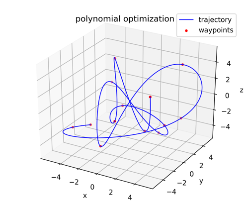

# PolyOpt
C++ version of https://github.com/ethz-asl/mav_trajectory_generation

Solve polynomial coefs with analytical solution or nonlinear optimization

# Build
```
cd [package root directory]
mkdir poly # used to save trajectory data
mkdir build
cd build
cmake ..
make -j8
```

# Test
run `./ test_poly_linear` will generate a polynomial trajectory pass the given waypoints. Resulted trajectory data will be save in `poly` folder. You can visualize the trajecotory will python.

# Example 



# References
- https://github.com/ethz-asl/mav_trajectory_generation